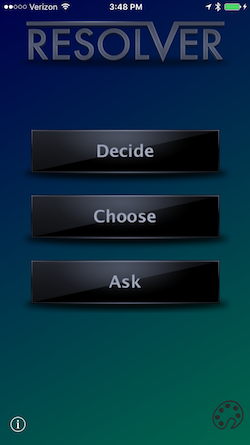

# Re-Resolver

Re-Resolver is a preservation attempt to revive Resolver - a once highly-rated decision
making app created in Iceland - from oblivion by system updates. The code is open source.

## Requirements

### Build Requirements
- Xcode 11
- Swift 5.x (included with Xcode 11)

You may also obtain a recent version of the app 
[from the App Store](https://itunes.apple.com/us/app/reresolver/id1137642671?mt=8).

#### Build Status

Continuous integration testing infrastructure and tools have been generously provided by [CircleCI](https://circleci.com/).

### Requirements

- Any iPhone, iPad, or iPod touch running a version of iOS or iPadOS from iOS 10 through iOS 13.
- You can also build the app to run on MacOS Catalina, but this is not a supported configuration due to UI/UX issues.
 
 **Important! There is a bug in iOS 13.0 that can cause the app to stop responding, especially on the "Ask" screen. For iOS 13 use, please upgrade to iOS 13.1 or higher** 
 
## Disclaimer

Re-Resolver does not contain any decision-making intelligence; it relies on a process that
 is statistically similar to randomness. Do not use Re-Resolver for important decisions.

As with nearly all software, Re-Resolver contains bugs. Do not ever rely on technology 
for anything critical.

## Acknowledgements

- Fancy Pants Global for creating the initial app
- Virginia Tech for partial sponsorship of the initial restoration effort
